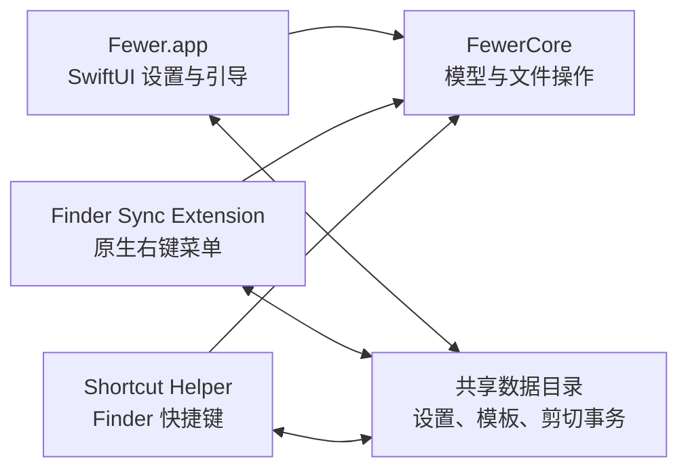

# Fewer v1 产品与技术设计

状态：已确认，等待书面规格复核
日期：2026-08-05
最低系统：macOS 14 Sonoma

## 1. 产品定义

Fewer 是一款原生 macOS 效率工具。它通过一个安装包承载多个日常能力，减少用户为了补足系统体验而安装多个独立软件的负担。

产品标语：**More tools. Fewer apps.**

第一版只交付 Finder 文件增强能力，不展示尚未实现的截图、日历等占位入口。未来能力作为 Fewer 内部功能加入同一个应用、设置中心、快捷键系统和更新通道，不拆成多个面向用户的软件。

### 1.1 应用标识

- 显示名称：`Fewer`
- 主应用：`com.number47.fewer`
- Finder 扩展：`com.number47.fewer.finder-extension`
- 快捷键助手：`com.number47.fewer.shortcut-helper`
- App Group：`group.com.number47.fewer`

用户只安装 `Fewer.app`。Finder 扩展和快捷键助手都嵌入该应用包，不单独出现在“应用程序”、Dock 或启动台中。

## 2. 第一版范围

### 2.1 必须交付

1. Finder 原生右键菜单，而不是“快速操作”子菜单或模拟右键窗口。
2. 在目录背景右键时通过模板新建文件。
3. 对选中文件或文件夹复制路径。
4. 对单个或多个选中项执行剪切，并在目标目录完成粘贴移动。
5. Finder 前台可用的 `Command-X`、`Command-V` 剪切粘贴闭环。
6. 一个完整的 SwiftUI 设置窗口，用于权限、菜单、模板、快捷键和通用行为管理。
7. 主应用、Finder 扩展和快捷键助手之间可靠共享设置与剪切状态。

### 2.2 明确不做

- 截图、日历及其他未来功能。
- 云同步、账号、订阅和跨设备同步。
- Finder 徽标、同步状态或 Finder 工具栏按钮。
- 绕过系统权限、SIP 或以管理员权限修改受保护位置。
- 尚未完成的功能入口和营销占位页。
- 第一版的 Mac App Store 上架、Developer ID 公证和自动更新服务；这些在功能验收后单独设计。

## 3. 用户路径

### 3.1 首次启动

1. 用户安装并打开 `Fewer.app`。
2. 概览页解释 Finder 扩展和快捷键权限的用途。
3. 应用检测 Finder 扩展是否启用；未启用时提供系统扩展管理入口。
4. 用户可独立启用全局快捷键；仅在启用时申请辅助功能权限。
5. 权限未授予时，应用明确显示降级状态：右键菜单仍可使用，`Command-X` / `Command-V` 不生效。

### 3.2 新建文件

1. 用户在 Finder 目录空白处打开原生右键菜单。
2. 选择“New File”，再从子菜单选择已启用模板。
3. Fewer 在当前目录复制模板并使用默认名称。
4. 若名称已存在，按照设置生成新名称、跳过或替换。
5. 创建成功后在 Finder 中选中新文件；仅在系统行为稳定时进入重命名状态，否则保留选中状态并发送结果通知。

### 3.3 复制路径

1. 用户选中一个或多个文件或文件夹。
2. 右键选择“Copy Path”。
3. 单选复制一个路径；多选按一行一个路径写入系统剪贴板。
4. 输出格式由设置决定：POSIX 绝对路径、带引号路径或 `file://` URL。

### 3.4 右键剪切与粘贴

1. 用户选中一个或多个项目并右键选择“Cut”。
2. Fewer 将文件 URL 写入系统剪贴板，并在 App Group 中记录剪切事务。
3. 用户进入目标目录，在背景右键选择“Paste Here”。
4. 文件按事务顺序移动；多个项目逐项返回结果。
5. 成功项目从事务中移除；失败项目保留，可修复问题后重试。

### 3.5 快捷键剪切与粘贴

1. Finder 位于前台且存在文件选择时，用户按 `Command-X`。
2. 快捷键助手拦截该组合键，通过 Finder 的复制行为取得标准文件剪贴板内容，并将其标记为 Fewer 剪切事务。
3. 用户在目标 Finder 目录按 `Command-V`。
4. 当剪贴板仍对应有效剪切事务时，助手将操作转换为 Finder 原生移动粘贴；否则完全交还 Finder 的普通粘贴行为。
5. Finder 原生路径负责目标判断、系统冲突界面、跨卷移动和撤销能力。

右键粘贴使用 Fewer 的冲突策略；快捷键粘贴遵循 Finder 原生冲突处理。设置界面会明确标注这一区别。

## 4. 工程架构

工程采用标准 Xcode 多 Target 结构：

### 4.1 主应用

- 使用 SwiftUI `WindowGroup` 提供唯一的设置/管理窗口。
- 负责首次启动引导、扩展状态、辅助功能权限、模板管理、菜单排序和行为配置。
- 使用系统自适应颜色、原生侧边栏和标准 macOS 控件。
- 不承担 Finder 菜单事件，也不需要为了右键功能常驻前台。

### 4.2 Finder Sync Extension

- 继承 `FIFinderSync`，通过 `menu(for:)` 返回原生 `NSMenu`。
- 使用 `FIFinderSyncController` 读取当前选中项和目标目录。
- 注册需要显示菜单的目录范围；第一版覆盖用户可访问的本地目录和已挂载卷，并在权限受限位置自然降级。
- 扩展保持 App Sandbox，并使用文件读写临时例外执行用户明确触发的任意目录操作；该能力按官网直装发行设计，提交 App Store 前需重新评估和说明例外用途。
- 不实现徽标和目录观察业务，避免无关工作影响 Finder 性能。
- 菜单构建只读取轻量配置，耗时文件操作移出菜单构建主路径。

### 4.3 Shortcut Helper

- 作为嵌入 `Fewer.app` 的隐藏登录项运行，由主应用通过系统服务启停。
- 仅在 Finder 为前台应用时处理已配置的快捷键。
- 使用事件监听拦截剪切/粘贴组合键，因此首次启用必须获得辅助功能权限。
- 不保存按键历史、不记录文本输入，也不在其他应用前台时分析普通键盘事件。
- 禁用功能、权限撤销或主应用卸载后停止工作。

### 4.4 FewerCore

共享核心模块包含：

- `FeatureSettings`：功能开关、菜单顺序、路径格式和冲突策略。
- `TemplateDescriptor`：模板身份、显示名称、文件名、来源、排序和启用状态。
- `ShortcutSettings`：快捷键组合、启用状态和冲突校验结果。
- `CutTransaction`：事务 ID、源文件 URL、创建时间、剪贴板标识和逐项状态。
- `MenuBuilder`：依据 Finder 场景和设置生成菜单描述。
- `TemplateStore`：内置与自定义模板读取、导入、复制和删除。
- `FileOperationCoordinator`：串行调度新建、移动与冲突处理。
- `ConflictNameResolver`：生成不冲突的文件名。

SwiftUI 和 AppKit 不各自维护第二份业务状态。主应用、扩展和助手均通过 FewerCore 的稳定接口访问共享数据。

## 5. Finder 菜单设计

### 5.1 目录背景菜单

- `New File` 子菜单：显示已启用模板，顺序来自设置。
- `Paste Here`：仅在存在有效剪切事务时显示。

### 5.2 文件项菜单

- `Copy Path`
- `Cut`
- 单选文件夹时可显示 `Paste Into Folder`，使用该文件夹作为明确目标。

菜单项直接来自 Finder Sync 原生菜单接口，不放进系统“Quick Actions”子菜单。最终显示位置仍由 Finder 控制。

### 5.3 菜单规则

- 菜单开关和排序在设置修改后写入 `~/Library/Application Support/Fewer/Shared`，扩展下一次构建菜单时读取新值。
- 没有选中项时不显示文件项操作。
- 剪切事务无有效源文件时不显示粘贴操作。
- 不支持的只读或受保护位置中，“New File”和“Paste”保持可诊断的禁用状态，避免点击后无反馈。

## 6. 设置界面

设置窗口采用 `NavigationSplitView`，第一版包含以下页面：

### 6.1 Overview

- Finder 扩展状态。
- 快捷键助手状态。
- 辅助功能权限状态。
- 打开系统扩展管理和隐私设置的操作入口。
- 第一版能力说明，不显示未来功能占位。

### 6.2 Context Menu

- 启用或关闭 `New File`、`Copy Path`、`Cut`、`Paste`。
- 拖动调整菜单顺序。
- 路径格式：绝对路径、带引号路径、`file://` URL。
- 多选路径固定为一行一个项目。

### 6.3 File Templates

- 查看内置模板和自定义模板。
- 启用/禁用、重命名显示名称和拖动排序。
- 导入任意现有文件作为模板。
- 在原生关联应用中打开自定义模板进行编辑。
- 复制模板或删除自定义模板。
- 内置模板不可直接破坏；需要修改时先复制为自定义模板。

### 6.4 Shortcuts

- 默认 `Command-X` 剪切、`Command-V` 粘贴。
- 单独启用/关闭快捷键助手。
- 快捷键录制、冲突检测、清除和恢复默认。
- 权限未授予时展示原因和修复入口，不伪装为已启用。

### 6.5 General

- 新建文件及右键粘贴的重名策略：保留两者、跳过、替换。
- 默认策略为“保留两者”。
- 成功/失败通知开关。
- 登录时启动快捷键助手。
- 诊断日志导出、版本和构建信息。

## 7. 模板系统

### 7.1 内置模板

第一版包含：

- Plain Text：`.txt`
- Markdown：`.md`
- Word Document：`.docx`
- Excel Workbook：`.xlsx`
- PowerPoint Presentation：`.pptx`
- JSON：`.json`
- CSV：`.csv`

不包含富文本 `.rtf`。

Office 模板必须是可由对应应用打开的合法空白文件，不能通过创建空字节文件后修改扩展名伪造。

### 7.2 自定义模板

- 导入时将源文件复制到 App Group 的模板目录，避免源文件移动或删除导致模板失效。
- 元数据使用带 `schemaVersion` 的 Codable 清单保存，以支持后续迁移。
- 模板文件名使用稳定 ID，与用户可编辑的显示名称分离。
- 删除自定义模板时同时删除清单项和 App Group 中的模板副本。

### 7.3 命名

- 默认名称来自模板显示名称，例如 `New Word Document.docx`。
- “保留两者”依次生成 `New Word Document 2.docx`、`New Word Document 3.docx`。
- 编号插入扩展名前，保留多段扩展名的完整语义。

## 8. 剪切事务与文件安全

### 8.1 事务规则

- 剪切本身不立即移动或删除文件，只记录意图并更新剪贴板。
- 用户复制或剪切其他内容后，旧事务失效。
- 成功粘贴后清除成功项目；失败项目保留以允许重试。
- 事务设置合理过期时间，避免数天后误执行旧剪切任务。
- 应用或扩展重启后仍可恢复未过期事务。

### 8.2 移动保护

- 禁止把目录移动到自身或其后代目录。
- 源和目标完全相同时视为无操作。
- 符号链接只移动链接本身。
- 多项目逐项执行，部分失败不回滚已成功项目。
- 默认绝不静默覆盖。
- “替换”只能由用户在设置中主动选择；能进入废纸篓的旧目标优先采用可恢复处理。
- 文件操作串行执行，防止快速重复点击导致同一事务并发运行。

## 9. 权限、隐私与性能

- App Group 仅用于应用自身组件共享配置、模板和事务。
- 快捷键助手的辅助功能权限是可选的；拒绝权限不会阻止右键功能。
- 第一版不接入账号、网络服务、遥测或广告 SDK。
- 诊断日志只记录操作类型、错误码和时间，不记录完整用户路径或文件内容；用户主动导出前可预览。
- Finder 菜单生成不得进行目录遍历、模板大文件读取或同步文件移动。
- 文件移动在专用串行队列执行，UI 和 Finder 菜单保持响应。

## 10. 错误处理

以下情况必须给出明确、可操作的结果：

- Finder 扩展未启用。
- 辅助功能权限未授予或被撤销。
- 源文件已移动或删除。
- 目标目录只读或属于系统保护范围。
- 外置磁盘已卸载。
- 云端文件尚未下载或提供者暂不可用。
- 目标存在同名文件。
- 模板损坏或格式不合法。
- 自定义快捷键与现有 Fewer 快捷键重复。

批量操作结束后汇总成功、跳过和失败数量，并允许查看失败原因。不能用“操作失败”代替具体原因。

## 11. 测试与验证

### 11.1 单元测试

- 重名编号与多段扩展名。
- 模板清单编码、迁移和排序。
- 菜单场景与功能开关。
- 路径格式和多选输出。
- 剪切事务建立、失效、部分成功和过期。
- 自身/后代目录移动保护。
- 快捷键冲突检测。

### 11.2 文件系统集成测试

使用独立临时目录验证：

- 所有内置模板均可创建且文件内容有效。
- 导入、编辑副本和删除自定义模板。
- 单文件、多文件、目录和符号链接移动。
- 重名的保留、跳过和替换策略。
- 只读目录、源文件消失和非法目标。

### 11.3 真机验收

- 构建完整 `Fewer.app`，确认包含主应用、Finder 扩展和隐藏助手。
- 在真实 Finder 的文件项、目录背景和单文件夹场景验证菜单。
- 设置修改后重新打开右键菜单即可读取新配置。
- 扩展或 Finder 重启后设置与模板仍存在。
- 权限授予前后分别验证快捷键降级和完整闭环。
- 验证 `Command-X` → `Command-V`，以及右键剪切 → 右键粘贴。
- 验证普通 Finder 复制粘贴不被快捷键助手改变。
- 验证浅色/深色模式、键盘导航和应用重启。

### 11.4 构建入口

实现阶段必须提供：

- `script/build_and_run.sh`：停止旧进程、构建、安装/启动最新应用，并支持验证模式。
- `.codex/environments/environment.toml`：将 Codex 的 Run 操作指向上述脚本。
- 一条可重复的 `xcodebuild` 测试命令。

不能仅以单个 Swift 文件编译或单元测试通过作为 Finder 扩展完成的证据。

## 12. 第一版完成标准

只有同时满足以下条件，第一版才算完成：

1. 用户只安装一个 `Fewer.app`。
2. Finder 原生右键菜单在目标位置真实出现。
3. 内置和自定义模板能创建有效文件。
4. 单选、多选复制路径符合设置。
5. 右键剪切和粘贴完成真实移动并正确处理失败项目。
6. 授权后 `Command-X` → `Command-V` 在 Finder 中可用，未授权时行为可解释。
7. 设置、模板顺序和快捷键配置在重启后保持。
8. 自动化测试通过，并完成真实 Finder 人工验收。
9. 所有未执行的分发、签名或上架验证均明确标记为未执行，不能以本地构建替代。

## 13. 后续扩展原则

未来截图、日历及其他能力通过内部功能注册机制加入同一个 Fewer 应用：

- 共用主应用窗口和侧边栏。
- 共用快捷键注册与冲突检测。
- 共用权限状态、通知和诊断体系。
- 每个功能保持独立模型与服务边界。
- 只有功能可用时才显示入口。
- 不为新增功能复制第二套设置应用、后台助手或更新通道。

该原则保证 Fewer 持续解决“软件太多”的核心痛点，而不是演变成多个独立应用的合集安装器。
